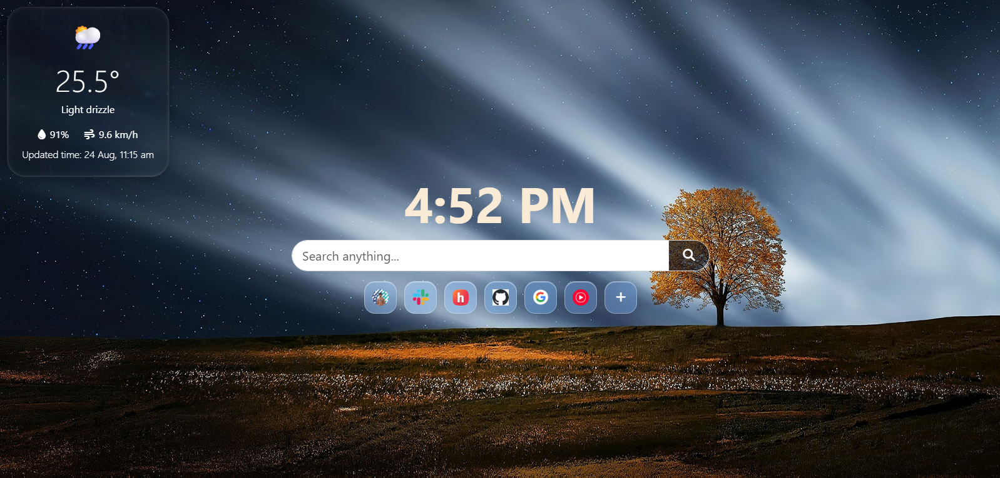

# OutSide-Newtab 

A minimal but beautiful newtab website with weather, clock, search,  shortcuts, and a efficient glassmorphism UI.

The weather widget is dragable, the user can position it anywhere. It stays there even after refreshing

## Features

- Weather data based on GPS location using Open-Meteo API
- Digital clock
- Google search
- Custom website shortcuts
- Automatic website favicons for shortcuts using Google favicon API
- Glass morphism style using [LiquidGlass](https://github.com/ybouane/liquidglass)

## Built With

- HTML, CSS and Javascript
- Jquery
- Bootstrap
- Font Awesome
- Open-Meteo API
- Google favicon API
- Nodejs Express
- [LiquidGlass](https://github.com/ybouane/liquidglass)

## Weather

Weather Datas:

- Temperature
- Weather condition name
- Humidity
- Wind speed

- Last updated time

#
#

Made with ❤️ in India by [Mrithul](https://github.com/Mrithul-E)

## License

MIT License.